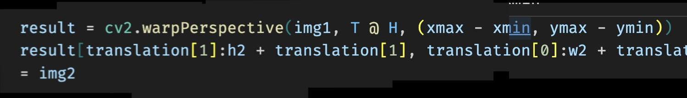

# Создание панорамы методами OpenCV

## Описание

Проект использует библиотеку python OpenCV для извлечения ключевых точек из изображений и их последующей склеики по ключевым точкам. Также поддерживается режим работы со Stitcher (готовый модуль из cv2 для создания панорам)

## Реализация:

- парсинг аргументов командной строки
- Загрузка и проверка изображений
- Выбор алгоритма создания панорамы
- Обработка изображений
- Обработка исключений в ходе работы с изображениями (паример: невозможно объеденить изображения по ключевым точкам)
- сохранение готовой панорамы

## Установка

```sh
git clone https://github.com/andrei1112111/MakePanorama.git
cd MakePanorama
pip install -r requirements.txt
```

## Запуск и примеры и спользвания

- -f <папка с фотографиями для сшивания в панораму>
- -m <алгоритм для создания панорамы(поддерживается SIFT и Stitcher)>
- -o <файл в который будет сохранена панорама>
- -i <формат файлов >

```sh
python main.py -f test_nature -m Stitcher -o test_result/Stitcher.jpg
```

```sh
Панорама успешно сохранена как test_result/Stitcher.jpg!
```

<p align="center">
 
</p>

<br>

```sh
python main.py -f test_screenshot -m SIFT -o test_result/SIFT.jpg -i png
```

```sh
Сшивание 1-го изображения...
Сшивание 2-го изображения...
Сшивание 3-го изображения...
Сшивание 4-го изображения...
Сшивание 5-го изображения...
Сшивание 6-го изображения...
Панорама успешно сохранена как test_result/SIFT.jpg!
```

<p align="center">
 
</p>

## Системные требования

- Python 3.9+
